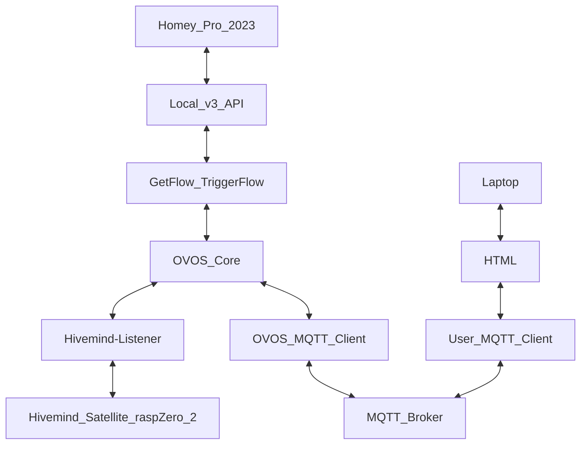

# **OVOS-Skill-HomeyFlowTrigger**

The `ovos-skill-HomeyFlowTrigger` repository is an OpenVoiceOS (OVOS) skill designed to integrate with the Homey Pro smart home ecosystem. It allows users to trigger Homey flows using voice commands, manage flow mappings, and interact with Homey through a web interface and MQTT communication.

---

## **Features**

1. **Homey API Integration**:
   - Communicates with Homey Pro using the Homey API v3 to retrieve and trigger flows.
   - Supports secure interaction with Homey using API keys.

2. **Flow Management**:
   - Dynamically fetches Homey flows and maps them to custom voice commands (utterances).
   - Allows users to edit, delete, or add new flows via a web interface.

3. **Web Interface**:
   - A simple HTML-based interface for managing `flow_mappings.json`.
   - Users can view, edit, and save flow mappings, as well as add new flows by fetching them from Homey.

4. **MQTT Communication**:
   - Uses MQTT to communicate between the web interface and the Python skill.
   - Topics include:
     - `request_flow_mappings`: Fetch the current flow mappings.
     - `send_flow_mappings`: Send the flow mappings to the web interface.
     - `save_flow_mappings`: Save updated flow mappings from the web interface.
     - `request_flows`: Fetch available flows from Homey.
     - `send_flows`: Send filtered flows from Homey to the web interface.

5. **Fuzzy Matching**:
   - Uses fuzzy logic to match voice commands to flows, even with slight deviations in utterances.

6. **Dynamic Intent Updates**:
   - Automatically updates `.intent` files and retrains OVOS Padatious when flow mappings are modified.

---

## **How It Works**

1. **Voice Command Execution**:
   - A user speaks a command (e.g., "aanwezig in kantoor").
   - The skill matches the command to a flow using fuzzy logic and triggers the corresponding flow via the Homey API.

2. **Flow Management via Web Interface**:
   - Users can view and edit `flow_mappings.json` in a user-friendly format.
   - New flows can be fetched from Homey and added to the mappings.

3. **MQTT Communication**:
   - The web interface publishes and subscribes to MQTT topics to interact with the Python skill.
   - The Python skill processes the requests and communicates with Homey via Node.js subprocesses.

---

## **Installation Guide**

### **1. Prerequisites**
- **Python**: Ensure Python 3.8+ is installed.
- **Node.js**: Install Node.js for running Homey API scripts.
- **MQTT Broker**: Set up an MQTT broker (e.g., Mosquitto) with secure TLS configuration.

### **2. Clone the Repository**
```bash
git clone https://github.com/your-repo/ovos-skill-HomeyFlowTrigger.git
cd ovos-skill-HomeyFlowTrigger
```

### **3. Install Python Dependencies**
Create a virtual environment and install the required Python libraries:
```bash
python -m venv venv
source venv/bin/activate  # On Windows: venv\Scripts\activate
pip install -r requirements.txt
```

### **4. Install Node.js Dependencies**
Navigate to the Node.js scripts directory and install dependencies:
```bash
cd nodejs
npm install homey-api
```

### **5. Configure Homey API**
- Generate an API key for Homey Pro via the Homey app or web interface.
- Update the `get_flow.js` and `start_flow.js` scripts with your Homey API key and IP address.

### **6. Configure MQTT Broker**
- Install and configure Mosquitto or another MQTT broker.
- Set up secure communication with TLS and user authentication.
- Update the Python skill and web interface with the broker's address, port, username, and password.

### **7. Run the Skill**
Start the skill in your OVOS environment:
```bash
systemctl --user restart ovos.service
```

### **8. Launch the Web Interface**
- Open the `index.html` file in a browser.
- Enter the brokers' host ip address
- Use the buttons to fetch, edit, and save flow mappings.

---

## **Connecting to the Broker and Homey**

### **1. Broker Configuration**
- Ensure the MQTT broker is running and accessible.
- Update the Python skill and web interface with the broker's connection details.

### **2. Homey API Configuration**
- Ensure you have the Homey Pro 2023
- Create a API access key on the homey
- Ensure the Homey Pro device is reachable on the network.
- Update the Node.js scripts with the correct API key and IP address.

### **3. Testing the Connection**
- Use the web interface to publish a `request_flow_mappings` topic.
- Verify that the Python skill responds with the `send_flow_mappings` topic.

---

## **Example Workflow**

1. **Fetch Flow Mappings**:
   - Click the "Fetch Flow Mappings" button in the web interface.
   - The Python skill publishes the current `flow_mappings.json` to the web interface.

2. **Edit Flow Mappings**:
   - Modify the flow mappings in the web interface (e.g., add or edit utterances).
   - Save the changes, which publishes the updated mappings to the broker.

3. **Add a New Flow**:
   - Click the "Request Flows" button to fetch available flows from Homey.
   - Select a flow and add it to the local mappings.

4. **Trigger a Flow**:
   - Speak a command that (almost) matches the intent/command given in the website.
   - The skill triggers the corresponding flow via the Homey API.

---

## **Topics Overview**

### **Published Topics**
1. `request_flow_mappings`: Request the current flow mappings.
2. `save_flow_mappings`: Save updated flow mappings.
3. `request_flows`: Request available flows from Homey.

### **Subscribed Topics**
1. `send_flow_mappings`: Receive the current flow mappings.
2. `saved_flow_mappings`: Receive a confirmation of saved mappings.
3. `send_flows`: Receive filtered flows from Homey.

---

## **Block Diagam**

```mermaid
  info
```


This repository provides a powerful and flexible way to control Homey flows using OVOS, enabling seamless integration between voice commands and smart home automation.